# 设置和管理您的Content AI源

本指南将指导您在Cloud Manager中设置内容人工智能源，包括满足先决条件以及创建内容源并确认其已编制索引和可用。

## 先决条件 {#prerequisites}

在开始之前，请确保满足以下条件：

* 您有一个有效的Cloud Manager项目，其中至少有一个AEM as a Cloud Service环境。
* 您在Admin Console中为程序担任&#x200B;**[系统管理员](https://experienceleague.adobe.com/zh-hans/docs/support-resources/adobe-support-tools-guide/adobe-admin-console/admin-roles)**&#x200B;角色。
* 已在&#x200B;**Adobe Admin Console**&#x200B;中配置环境产品配置文件，请参阅[设置Adobe Developer Console项目](setup-adc-project.md)。

## 步骤1 — 打开内容人工智能配置选项卡 {#open-tab}

1. 登录到[Cloud Manager](https://my.cloudmanager.adobe.com/)并选择您的程序。

   显示程序卡的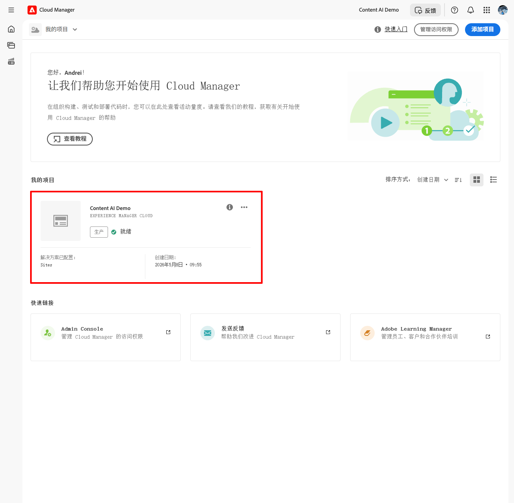

1. 从&#x200B;**[!UICONTROL 项目概述]**&#x200B;中，找到&#x200B;**[!UICONTROL 环境]**&#x200B;部分，然后选择要配置的环境。

   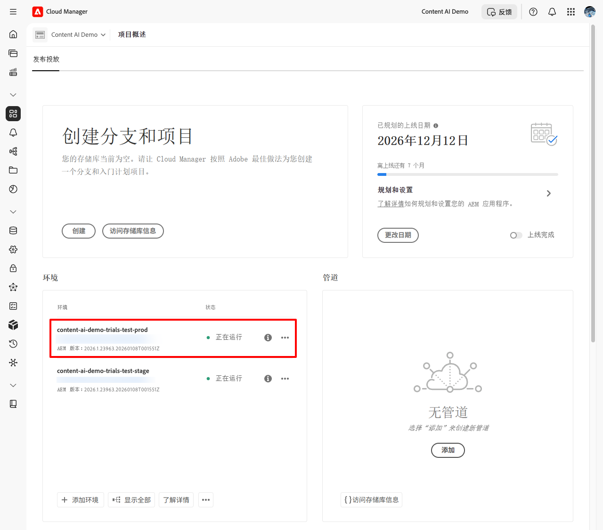

1. 在环境详细信息页面上，选择&#x200B;**[!UICONTROL Content AI配置]**&#x200B;选项卡。

   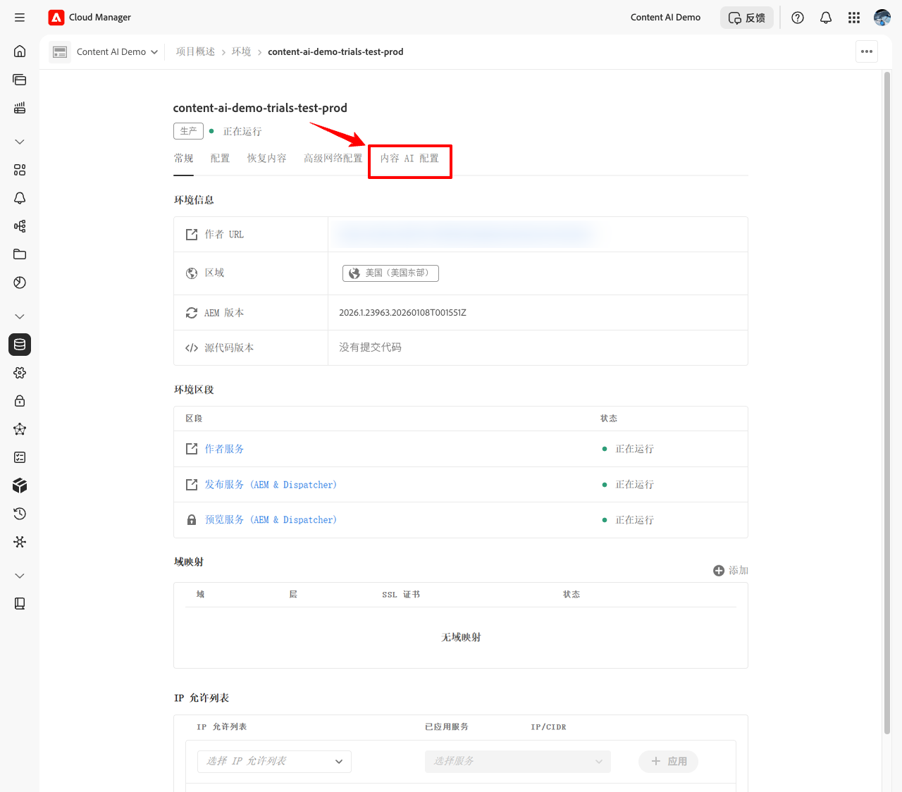

## 步骤2 — 创建内容人工智能Source {#create-source}

内容源定义Content AI抓取和索引的网站。

1. 在&#x200B;**[!UICONTROL Content AI配置]**&#x200B;选项卡上，选择&#x200B;**[!UICONTROL 创建Source]**。

   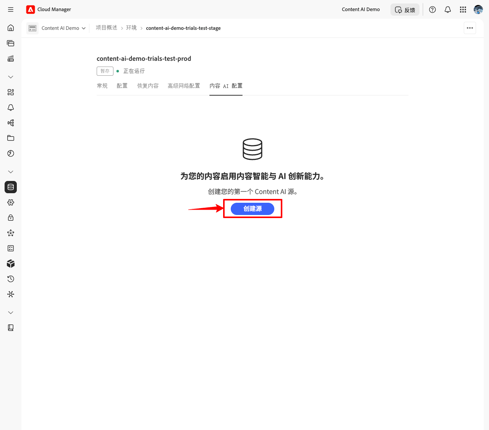

1. 在&#x200B;**[!UICONTROL 创建/添加新内容AI Source]**&#x200B;对话框中，填写以下字段：

   | 字段 | 描述 |
   | --- | --- |
   | **[!UICONTROL Content AI配置名称]** | 此源的唯一标识符（例如，`my-site-index`）。 创建后无法更改。 |
   | **[!UICONTROL 描述]** | *（可选）*&#x200B;内容源的简短说明。 |
   | **[!UICONTROL 网址]** | 要抓取的网站的根URL（例如，`https://www.example.com/`）。 |
   | **[!UICONTROL 排除URL]** | 抓取期间要跳过的&#x200B;*（可选）* URL模式。 |
   | **[!UICONTROL 刷新频率]** | 内容人工智能重新抓取源的频率：每周、每天、每日4×、60分钟或15分钟。 |

   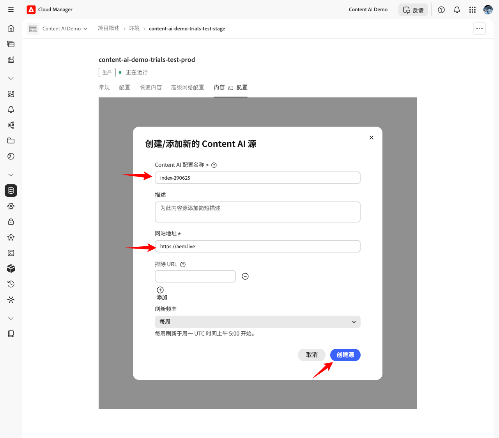

   显示可用选项的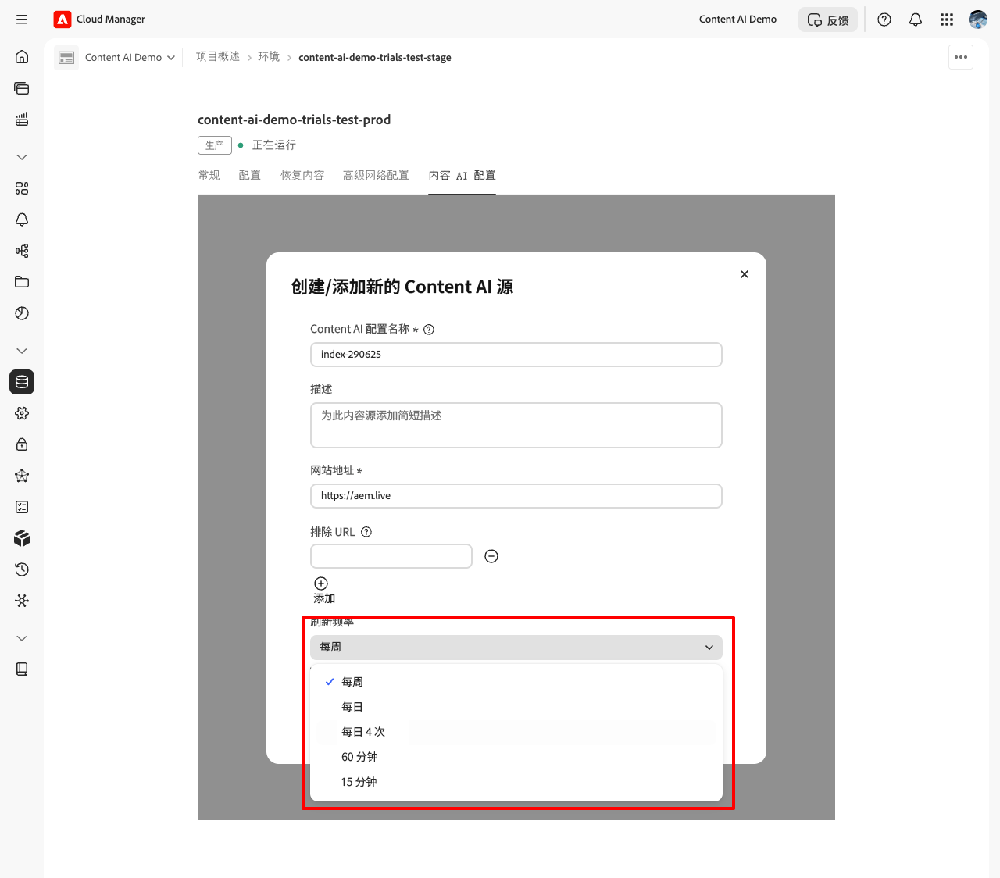

1. 选择&#x200B;**[!UICONTROL 创建Source]**。

## 步骤3 — 触发客户获取 {#trigger-acquisition}

创建源后，其状态为&#x200B;**新建**。 运行初始客户获取以开始编制索引。

1. 在源列表中，选择源旁边的&#x200B;**更多操作** (...)图标，然后选择&#x200B;**[!UICONTROL 触发客户获取]**。

   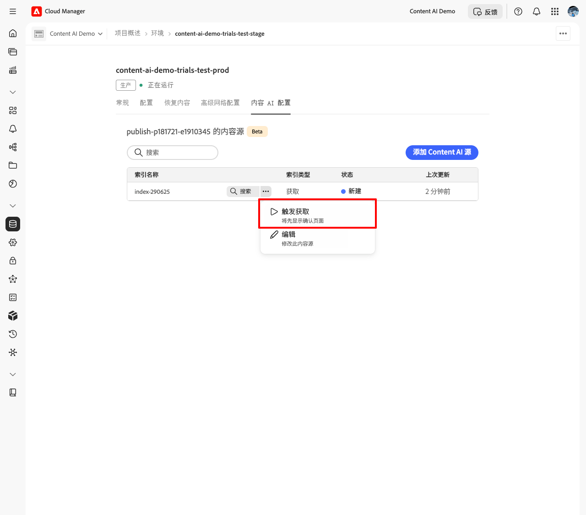

1. 在&#x200B;**[!UICONTROL 触发器获取]**&#x200B;对话框中，查看源详细信息 — **[!UICONTROL 内容源]**、**[!UICONTROL 上次运行]**&#x200B;和&#x200B;**[!UICONTROL 下次计划运行]** — 并选择&#x200B;**[!UICONTROL 触发器]**。

   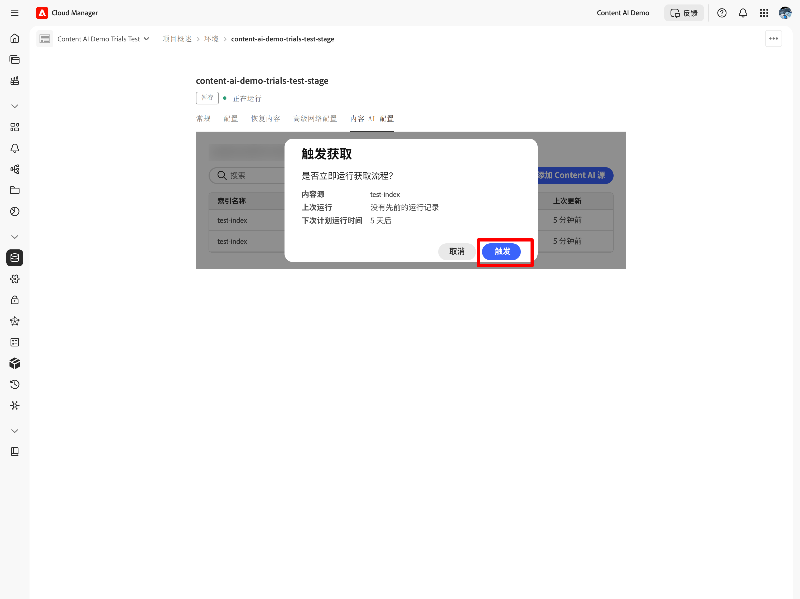

## 步骤4 — 监控索引状态 {#monitor-status}

客户获取开始后，源状态会实时更新。

| 状态 | 含义 |
| --- | --- |
| **新建** | 已创建Source；尚未运行任何客户获取。 |
| **索引** | 正在获取；正在抓取内容并将其编入索引。 |
| **可用** | 索引已完成；源已准备好提供搜索查询。 |

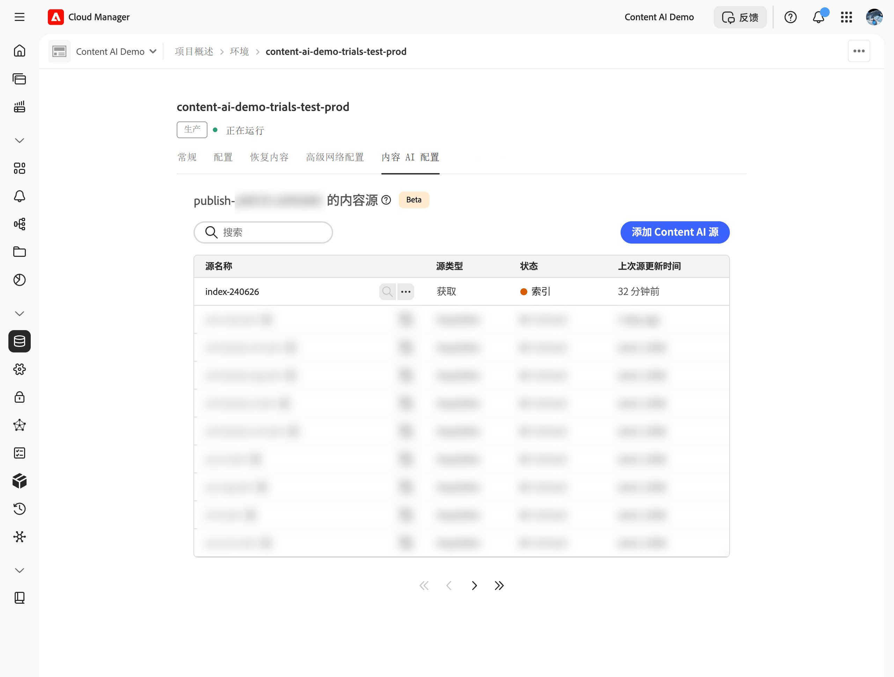

在搜索索引或测试API之前，等待状态达到&#x200B;**可用**。

## 步骤5 — 搜索索引内容 {#search-content}

在源状态为&#x200B;**可用**&#x200B;后，您可以直接从Cloud Manager运行搜索查询以验证内容是否已正确编入索引。

1. 在源列表中，选择源旁边的&#x200B;**[!UICONTROL 搜索]**。

   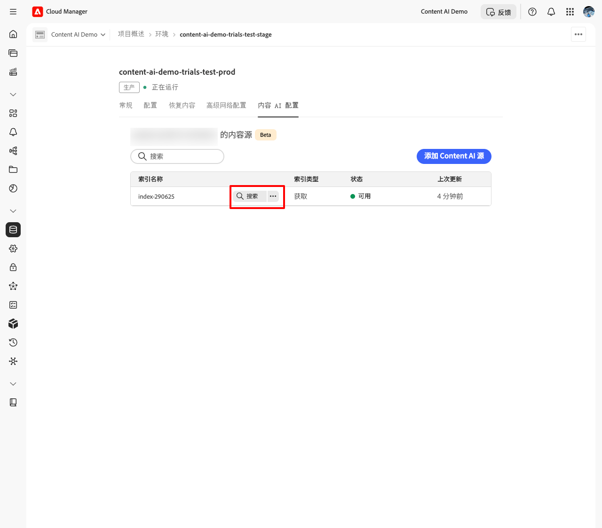

1. 在搜索字段中输入查询。 结果将显示具有匹配得分和内容类型的匹配项列表（例如，**PAGE**&#x200B;或&#x200B;**PDF**）。 选择结果将在右侧打开预览。

   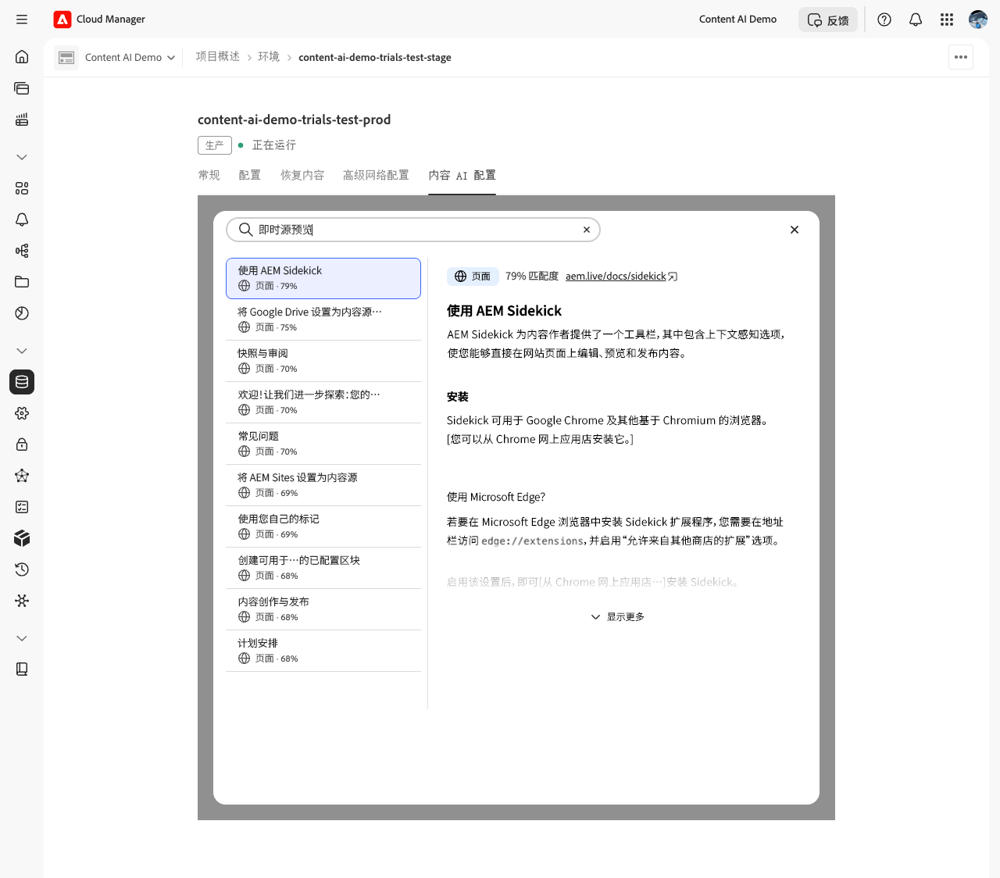

## 修改或删除Source {#modify-source}

要在创建源配置后对其进行更新，请执行以下操作：

1. 在源列表中，选择源旁边的&#x200B;**更多操作** (...)图标，然后选择&#x200B;**[!UICONTROL 编辑]**。

   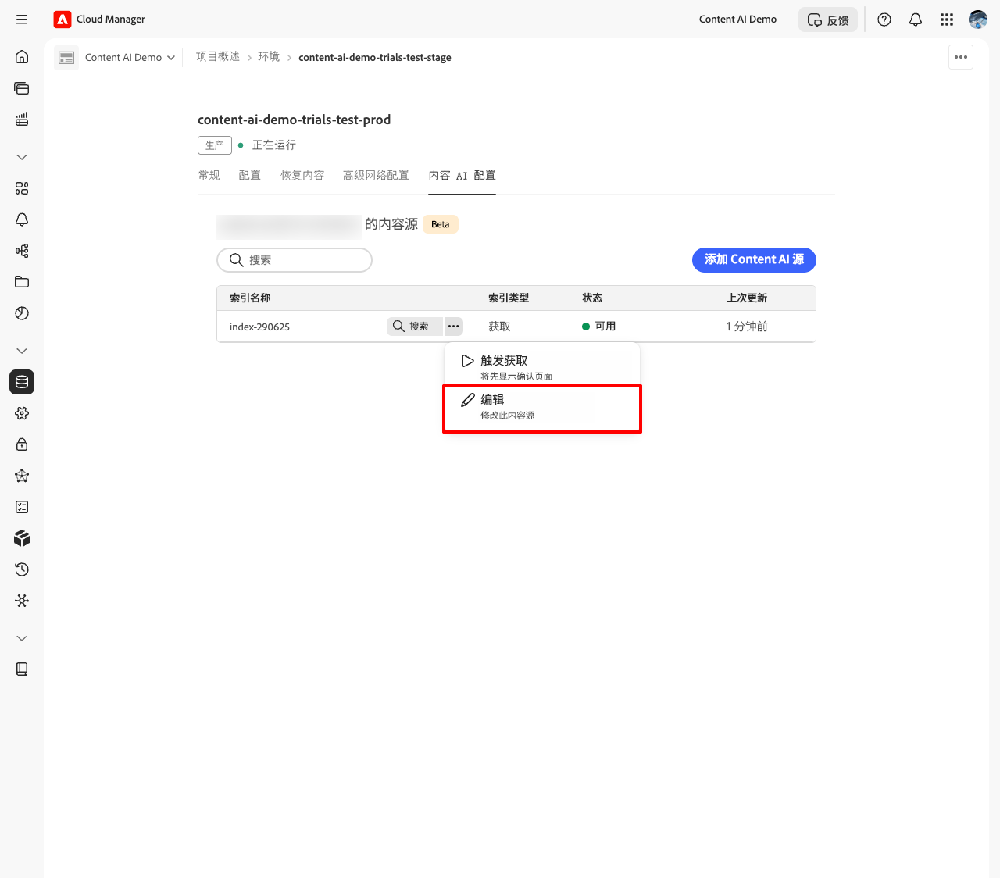

1. 在&#x200B;**[!UICONTROL 修改内容人工智能Source]**&#x200B;对话框中，根据需要更新&#x200B;**[!UICONTROL 描述]**、**[!UICONTROL 网站地址]**、**[!UICONTROL 排除URL]**&#x200B;或&#x200B;**[!UICONTROL 刷新频率]**。 **[!UICONTROL Content AI配置名称]**&#x200B;是只读的，无法更改。

1. 选择&#x200B;**[!UICONTROL 保存]**&#x200B;以应用更改，或选择对话框左下角的&#x200B;**[!UICONTROL 删除]**&#x200B;以完全删除源。

   >[!WARNING]
   >
   >删除源是永久性的。 该源的所有索引内容都将被删除，并且无法再提供搜索查询。

   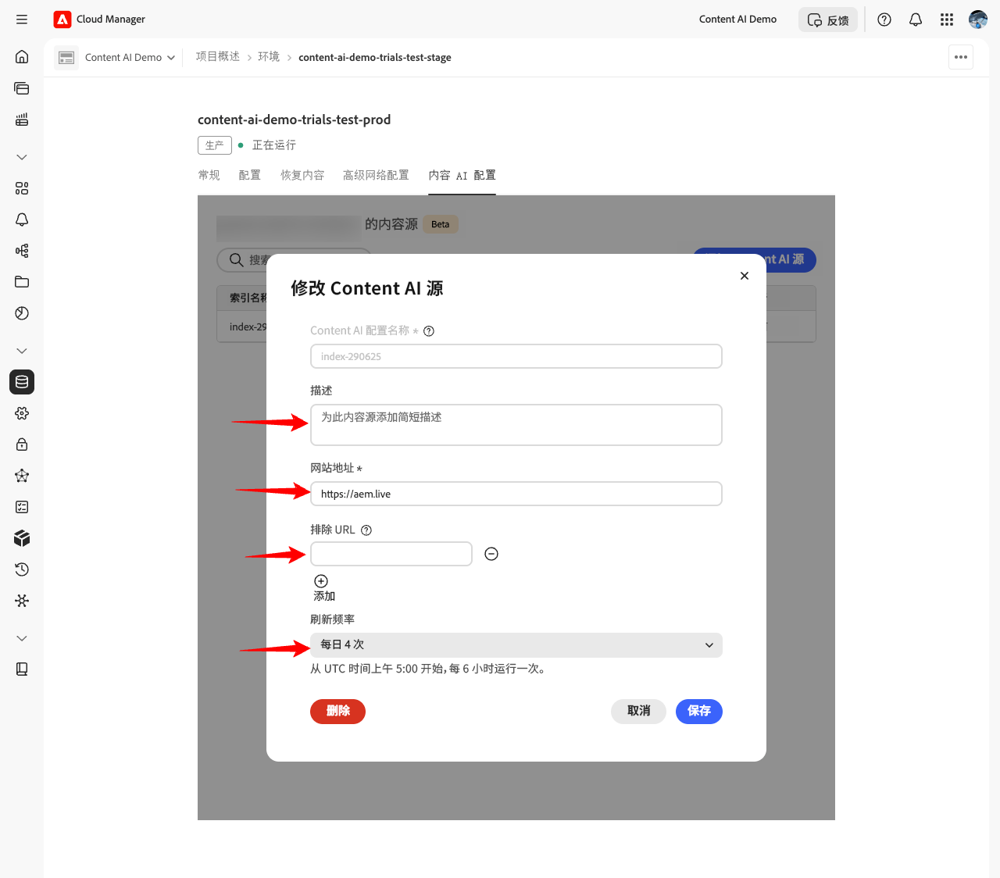

源列表会更新以反映所做的更改。 如果删除了源，则该源不再出现在列表中。

## 后续步骤 {#next-steps}

* [设置Adobe Developer Console项目](setup-adc-project.md) — 创建调用API所需的ADC项目和凭据。
* [内容人工智能API引用](https://developer.adobe.com/experience-cloud/experience-manager-apis/api/experimental/contentai/) — 使用语义、全文或混合搜索端点查询已索引的内容。

## 疑难解答 {#troubleshooting}

* **Source在[!UICONTROL 索引]中保留较长时间。** 从(...)菜单重试客户获取。 如果第二次运行后状态未提升，请验证&#x200B;**[!UICONTROL 网站地址]**&#x200B;是否可公开访问，以及&#x200B;**[!UICONTROL 排除URL]**&#x200B;模式是否不会过滤掉每个页面。
* 运行后&#x200B;**Source移回[!UICONTROL 新建]。** 爬虫无法从配置的根URL获取任何页面。 确认URL使用`200 OK`进行响应，并且站点未阻止自动请求。
* **[!UICONTROL 搜索]未返回[!UICONTROL 可用]源的结果。** 索引成功，但没有与查询匹配的内容。 尝试更广泛的查询，或检查抓取的URL是否包含您期望的页面。
