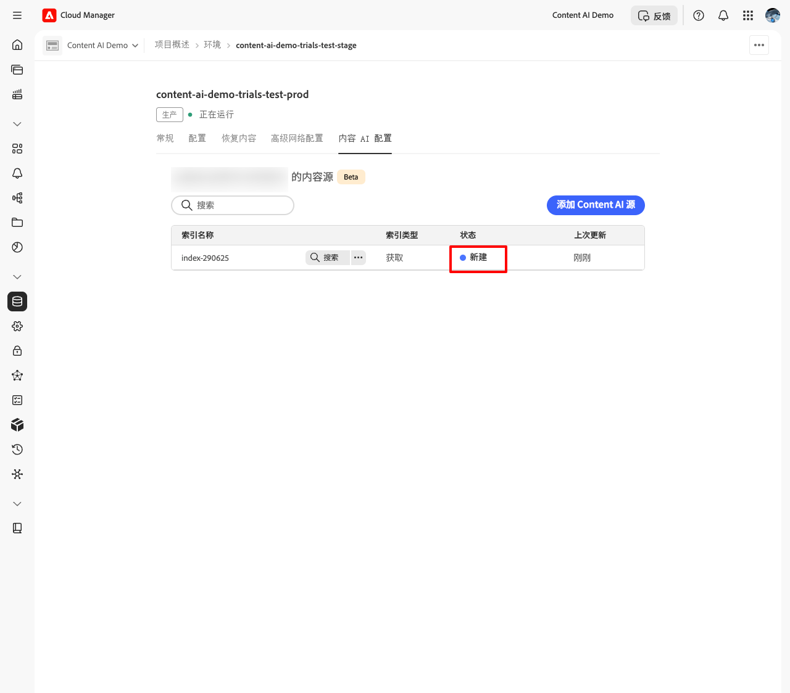

# 设置和管理您的内容人工智能源

本指南将引导您在 Cloud Manager 中设置内容人工智能源，包括满足先决条件、创建内容源，以及确认内容已建立索引并可供使用。

## 先决条件 {#prerequisites}

开始之前，请确保满足以下条件：

* 您拥有一个处于活动状态的 Cloud Manager 程序，并且其中至少包含一个 AEM as a Cloud Service 环境。
* 您的用户已分配给目标环境的&#x200B;**AEM用户**&#x200B;产品配置文件，该配置文件允许用户查看内容源。
* 您的用户已分配给目标环境的&#x200B;**AEM管理员**&#x200B;产品配置文件，该配置文件允许用户创建和编辑内容源。 仅访问Cloud Manager是不够的 — 请参阅下面的[将用户分配到AEM产品配置文件](#assign-product-profile)。
* 已在&#x200B;**Adobe Admin Console**&#x200B;中配置环境产品配置文件。

## 将用户分配给AEM产品配置文件 {#assign-product-profile}

使用此过程可授予用户访问特定环境的[!DNL Adobe Experience Manager] as a Cloud Service的权限。 分配与用户所需的访问权限相匹配的配置文件：

* **[!UICONTROL AEM用户]** — 查看内容源。
* **[!UICONTROL AEM管理员]** — 创建和编辑内容源。

>[!NOTE]
>
>用户必须属于AEM产品配置文件，如&#x200B;**[!UICONTROL AEM Users]**&#x200B;或&#x200B;**[!UICONTROL AEM Administrators]**，才能访问AEM。 仅访问Cloud Manager是不够的。

要分配这些配置文件，您必须是具有[!UICONTROL 业务负责人] Cloud Manager产品配置文件的系统管理员。 准备好用户的名称和电子邮件地址。

1. 在[Cloud Manager](https://my.cloudmanager.adobe.com/)中，导航到您的项目并为目标环境选择&#x200B;**[!UICONTROL 管理访问权限]**。 将为该环境打开一个新选项卡[!DNL Adobe Admin Console]。
1. 为&#x200B;**发布**&#x200B;层选择&#x200B;**[!UICONTROL AEM用户]**&#x200B;或&#x200B;**[!UICONTROL AEM管理员]**&#x200B;产品配置文件 — 例如，`AEM Administrators - publish - Program 12345 - Environment 67890`。 内容人工智能对发布的内容编制索引，因此用户档案必须在发布级别分配，而不是在作者级别分配。
1. 选择&#x200B;**[!UICONTROL 添加用户]**。
1. 输入用户的名称和电子邮件地址，然后保存更改。 用户将会添加到产品配置文件。

对用户需要访问的每个环境（如开发、暂存或生产）重复这些步骤。

>[!CAUTION]
>
>请勿编辑或删除名为&#x200B;**[!UICONTROL AEM Administrators]**&#x200B;或&#x200B;**[!UICONTROL AEM Users]**&#x200B;的默认产品配置文件。 重命名&#x200B;**[!UICONTROL AEM Administrators]**&#x200B;会删除分配给它的每个人的管理员权限。

### 验证分配 {#verify-assignment}

验证分配是否成功：

1. 在[!DNL Admin Console]中，重新打开您分配的产品配置文件。
1. 确认该用户出现在成员列表中。

如果您正在排查访问或令牌问题，请确认已将用户直接添加到产品配置文件中，而非仅通过组进行添加。

## 步骤 1：打开“内容人工智能配置”选项卡 {#open-tab}

1. 登录 [Cloud Manager](https://my.cloudmanager.adobe.com/) 并选择您的程序。

   

1. 在&#x200B;**[!UICONTROL 程序概览]**&#x200B;页面中，找到&#x200B;**[!UICONTROL 环境]**&#x200B;部分，然后选择要配置的环境。

   

1. 在环境详细信息页面中，选择 **[!UICONTROL 内容人工智能配置]**&#x200B;选项卡。

   

## 步骤 2：创建内容人工智能源 {#create-source}

内容源用于定义内容人工智能将要抓取和建立索引的网站。

1. 在 **[!UICONTROL 内容人工智能配置]**&#x200B;选项卡中，选择&#x200B;**[!UICONTROL 创建源]**。

   

1. 在&#x200B;**[!UICONTROL 创建/添加新的内容人工智能源]**&#x200B;对话框中，填写以下字段：

   | 字段 | 描述 |
   | --- | --- |
   | **[!UICONTROL 内容人工智能配置名称]** | 此源的唯一标识符（例如：`my-site-index`）。 创建后无法修改。 |
   | **[!UICONTROL 描述]** | *（可选）*&#x200B;内容源的简要说明。 |
   | **[!UICONTROL 网站地址]** | 要抓取的网站根 URL（例如：`https://www.example.com/`）。 |
   | **[!UICONTROL 排除 URL]** | *（可选）*&#x200B;抓取过程中需要跳过的 URL 模式。 |
   | **[!UICONTROL 刷新频率]** | 内容人工智能重新抓取该源的频率：每周、每天、每天 4 次、每 60 分钟或每 15 分钟。 |

   

   

1. 选择&#x200B;**[!UICONTROL 创建源]**。 自动开始客户获取，源将移至&#x200B;**索引**。

   

## 步骤3 — 重新运行客户获取 {#trigger-acquisition}

创建源时，客户获取会自动运行，然后按照&#x200B;**[!UICONTROL 刷新频率]**&#x200B;设置的计划运行。 您还可以随时手动触发运行 — 例如，在发布新内容后立即重新索引。

1. 在源列表中，选择源旁边的&#x200B;**更多操作**（…）图标，然后选择&#x200B;**[!UICONTROL 触发获取]**。

   

1. 在&#x200B;**[!UICONTROL 触发获取]**&#x200B;对话框中，检查源详细信息（包括&#x200B;**[!UICONTROL 内容源]**、**[!UICONTROL 上次运行时间]**&#x200B;和&#x200B;**[!UICONTROL 下次计划运行时间]**），然后选择&#x200B;**[!UICONTROL 触发]**。

   

## 步骤 4：监控索引状态 {#monitor-status}

内容获取开始后，源状态会实时更新。

| 状态 | 含义 |
| --- | --- |
| **新建** | Source刚刚创建；自动客户获取尚未开始。 此状态是短暂的。 |
| **正在索引** | 内容获取正在进行中；系统正在抓取内容并建立索引。 |
| **可用** | 索引已完成，源已可用于搜索查询。 |

在搜索索引内容或测试 API 之前，请等待状态变为&#x200B;**可用**。

## 步骤 5：搜索已建立索引的内容 {#search-content}

当源状态变为&#x200B;**可用**&#x200B;后，您可以直接在 Cloud Manager 中执行搜索查询，以验证内容是否已正确建立索引。

1. 在源列表中，选择源旁边的&#x200B;**搜索** （放大镜）图标。

   

1. 在搜索框中输入查询内容。 搜索结果会显示匹配项列表，并包含匹配得分以及内容类型（例如 **PAGE** 或 **PDF**）。 选择某个结果后，会在右侧打开预览窗口。

   

## 修改或删除源 {#modify-source}

### 修改源 {#modify}

若要在创建后更新源配置：

1. 在源列表中，选择源旁边的&#x200B;**更多操作**（…）图标，然后选择&#x200B;**[!UICONTROL 编辑]**。

   

1. 在&#x200B;**[!UICONTROL 修改内容人工智能源]**&#x200B;对话框中，根据需要更新&#x200B;**[!UICONTROL 描述]**、**[!UICONTROL 网站地址]**、**[!UICONTROL 排除 URL]**&#x200B;或&#x200B;**[!UICONTROL 刷新频率]**。 **[!UICONTROL 内容人工智能配置名称]**&#x200B;为只读字段，无法修改。

   

1. 选择&#x200B;**[!UICONTROL 保存]**&#x200B;以应用更改。 源列表会更新并显示您所做的更改。

### 删除源 {#delete}

1. 在源列表中，选择源旁边的&#x200B;**更多操作** (...)图标，然后选择&#x200B;**[!UICONTROL 删除]**。

   >[!WARNING]
   >
   >删除源后无法恢复。 与该源关联的所有已建立索引的内容都会删除，并且无法再用于搜索查询。

删除后，源不再显示在列表中。

## 后续步骤 {#next-steps}

* [设置 Adobe Developer Console 项目](setup-adc-project.md)：创建调用 API 所需的 ADC 项目和凭据。
* [内容人工智能API 参考](https://developer.adobe.com/experience-cloud/experience-manager-apis/api/experimental/contentai/)：使用语义搜索、全文搜索或混合搜索端点查询已建立索引的内容。

## 故障排除 {#troubleshooting}

* **源长时间停留在[!UICONTROL 正在索引]状态。** 从“（…）”菜单中重新触发内容获取。 如果第二次运行后状态仍未推进，请确认&#x200B;**[!UICONTROL 网站地址]**&#x200B;可从公共网络访问，并确保&#x200B;**[!UICONTROL 排除 URL]** 规则没有将所有页面全部过滤掉。
* **源在运行后又恢复为[!UICONTROL 新建]状态。** 爬虫无法从配置的根 URL 获取任何页面。 请确认该 URL 返回 `200 OK` 响应，并且网站未阻止自动化请求。
* 对状态为[!UICONTROL 可用]的源执行&#x200B;**[!UICONTROL 搜索]时未返回结果。** 索引已成功建立，但没有内容与查询条件匹配。 请尝试使用范围更广的查询条件，或检查已抓取的 URL 是否包含您期望的页面。
