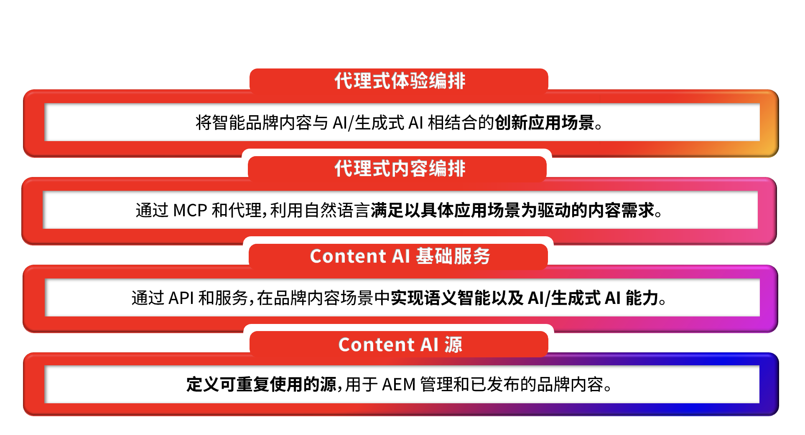

# AEM 内容人工智能简介

## 智能内容，生而适配 AI {#ai-ready}

客户开始通过AI与品牌见面，然后再与网站见面。 聊天助理、AI概述、代理、对话式搜索、AI门卫 — 所有这些人都代表品牌检索、总结和呈现品牌内容。 他们所说的内容只有准确、最新和品牌化，才会是他们可以触及的内容。
这是AEM Content AI专为这种转变而构建的功能。 它将品牌内容视为AI体验运行的基本事实，并为AEM客户提供了工具，以便在创作端更快地创建基本事实，并在发布端为面向消费者的AI驱动型体验干净地提供该事实。

**在创作端**，AEM 内容人工智能以经过批准的品牌源作为内容创作基础。 借助 AI 辅助创作、跨现有页面内容、内容片段和资源的自然语言发现能力，以及品牌感知生成能力，团队无需离开 AEM，即可为新的受众、地区和渠道创建内容变体，同时确保内容始终符合已获批准的品牌标准。

**在发布端**，同一份内容会经过结构化管理、治理和统一编址，以便 AI 能够有效使用。 内容片段、元数据、分类体系以及已批准的内容源，会以检索系统、智能代理和对话式界面能够可靠使用的形式进行提供，从而确保 AI 在代表品牌发声时，传达的是品牌真实且可信的信息。

### 这对 AEM 客户意味着什么 {#what-it-means}

已获批准的内容是品牌避免幻觉的防线。 当AI基于受管理的AEM内容时，默认情况下答案保持准确、最新且符合品牌标准。
创作速度与人工智能时代的需求保持同步。 团队为创作体验中的更多受众和时刻生成文案和图像 — 从批准的来源而不是从空白开始。
发现就像人和机器实际要求的那样。 跨资产、片段、页面和表单的基于意图的自然语言搜索可将现有内容转换为可重复使用的内容。
Personalization通过重复使用而不是重复进行扩展。 受控制的组件将重组为变体，而不是乘以不受跟踪的副本。
发布渠道现在包括AI表面。 内容以人类、代理和人工智能媒介的体验都可以消费的形式提供 — 没有针对每一种的单独管道。

**更重要的是：现有的可信品牌内容，其价值比以往任何时候都更加重要。 AEM 中每一个已获批准的内容片段、资源和页面，都将成为 AI 驱动体验所依赖的事实基础。而 AEM 内容人工智能则让这些内容能够重复利用、轻松发现，并随时为未来的 AI 体验提供支持。**

## AEM 内容人工智能概览 {#at-a-glance}

AEM 内容人工智能采用四层架构设计，每一层都建立在其下层基础之上，从底层的可信内容逐步延伸到顶层由其驱动的代理式体验。

*请自下而上理解这一架构，从底层的可信内容开始，到顶层由其驱动的智能代理体验。*

1. 内容人工智能源
内容源是 AEM 内容人工智能中用于连接可信内容资产的受管理实体。 内容源可以引用 AEM 管理的内容类型，例如资源、内容片段、页面、表单、元数据和分类体系；同时也支持引用非 AEM 源，例如第三方网站、知识库或文档门户。 每个内容源都会自动完成向量化处理并进行语义增强，从而支持内容检索、事实依据构建以及对话式 AI 体验。 内容源只需定义一次，即可在多个内容人工智能 API 中重复使用，并自动获得内容更新和新鲜度维护能力。

1. 内容人工智能基础服务
这些 API 和服务为品牌内容提供语义智能和生成式 AI 能力。 这些服务构建于内容人工智能源之上，可支持内容检索、内容生成、品牌感知内容变体生成以及内容优化，并且所有结果均基于客户已批准的内容。

1. 代理式内容编排
MCP 和代理通过自然语言，将具体业务场景驱动的内容需求转化为协同执行的操作流程。 在这一层中，内容创作者和其他代理只需使用自然语言描述需求，系统便会自动协调相应的基础服务来完成任务。

1. 代理式体验编排
当智能化品牌内容与大规模 AI 应用相结合时，将催生各种创新应用场景。 AEM 自身的解决方案正是构建于这些基础服务之上，同时客户也可以直接使用相同的 API，在自己的内容基础上构建专属的代理式体验。 从 AI 驱动的内容供应链到对话式用户旅程，这一层让受治理的内容真正转化为企业的竞争优势。

这些层级通过统一设计紧密连接：所有 AI 服务都基于同一内容基础运行，而所有生成结果也会回流至同一个受治理的系统中，从而确保创作端与发布端共享同一个事实来源。

## AEM 内容人工智能实际应用 {#action}

要完成可运行的内容人工智能集成，需要完成以下两项任务：

### &#x200B;1. 为您的 AEM 环境启用内容人工智能 {#enable}

**先决条件：**&#x200B;在开始使用内容人工智能之前，您需要获取与您的 AEM as a Cloud Service 环境关联的 API 凭据。 请参阅[设置 Adobe Developer Console 项目](setup-adc-project.md)。

### &#x200B;2. 管理您的内容人工智能源 {#control}

设置并管理您的内容人工智能源，以启用基于 AI 的体验。有关详细信息，请参阅[管理您的内容源](contentsources.md)。

## 了解内容人工智能 API  {#apis}

探索 AEM 内容人工智能的丰富功能能力，这些 API 展现了该平台的完整潜力。 查看[内容人工智能 API](https://developer.adobe.com/experience-cloud/experience-manager-apis/api/experimental/contentai/)。
