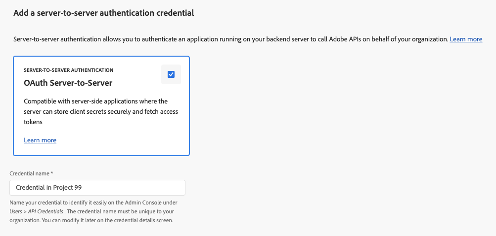
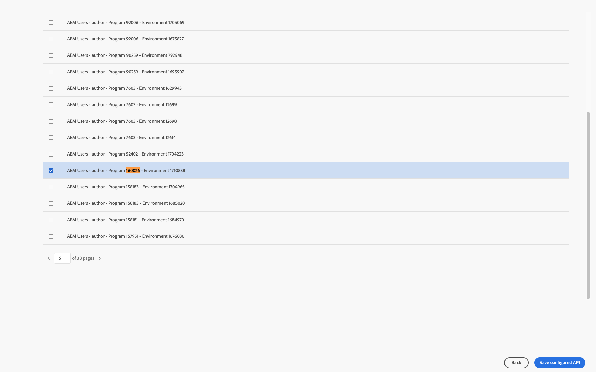
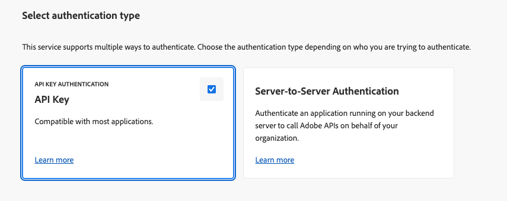
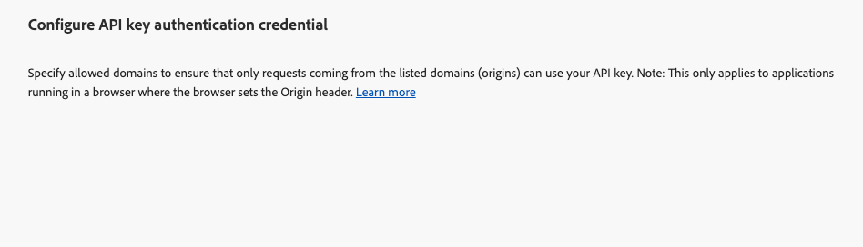
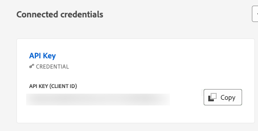

# 设置 Adobe Developer Console 项目 {#configure-adc-project}

要调用 AEM 内容人工智能 Services API，您需要使用由 Adobe Developer Console（ADC）项目颁发的凭据。 本文将指导您创建项目、选择身份验证方式，以及生成每次 API 请求所需的凭据。

首先，访问您组织的 [Adobe Developer Console](https://developer.adobe.com/console/)。

## 先决条件 {#prerequisites}

开始之前，请确保满足以下条件：

* 您拥有访问组织 [Adobe Developer Console](https://developer.adobe.com/console/) 的权限。
* 您已在 **Adobe Admin Console** 中被添加为 AEM 内容人工智能 Services 产品轮廓的&#x200B;**开发人员**。 如果没有该角色，**[!UICONTROL AEM 内容人工智能 Services]** API 卡片将显示为禁用状态，并且不会显示&#x200B;**[!UICONTROL 服务器到服务器]**&#x200B;身份验证选项。
* 您已了解要选择的产品轮廓对应的项目编号和环境编号（例如：`AEM User - publish - Program 12345 - Environment 67890`）。
* 您在该程序对应的 Admin Console 中拥有&#x200B;**[系统管理员](https://experienceleague.adobe.com/zh-hans/docs/support-resources/adobe-support-tools-guide/adobe-admin-console/admin-roles)**&#x200B;角色。 利用此角色，可管理产品配置文件并将用户分配给环境。

## 选择身份验证方式 {#choose-auth}

AEM 内容人工智能 Services 支持两种身份验证方式。 请选择与您的集成场景相匹配的方式：

| 方法 | 最适合 |
| --- | --- |
| [服务器到服务器](#s2s-auth) | 适用于无需用户参与即可调用 API 的后端服务。 返回短期有效的访问令牌。 |
| [API 密钥](#api-key-auth) | 适用于客户端或基于浏览器直接调用 API 的集成场景。 返回与指定允许域绑定的长期有效密钥。 |

## 服务器到服务器身份验证 {#s2s-auth}

1. 依次选择 **[!UICONTROL API 和服务]**&#x200B;和 **[!UICONTROL API]**。

   

1. 按 **AEM 内容人工智能 Services** 进行筛选，然后选择&#x200B;**[!UICONTROL 创建项目]**&#x200B;以创建新项目；如果要将该服务添加到现有项目中，请选择&#x200B;**[!UICONTROL 添加 API]**。

   >[!NOTE]
   >
   >如果 API 卡片显示“需要许可证”并处于禁用状态，则您的 AEM as a Cloud Service 环境可能尚未完成现代化升级。 请参阅 [AEM as a Cloud Service 环境现代化升级](https://experienceleague.adobe.com/zh-hans/docs/experience-manager-learn/cloud-service/aem-apis/openapis/setup#modernization-of-aem-as-a-cloud-service-environment)。

1. 在&#x200B;**[!UICONTROL 配置 API]** 对话框中，选择&#x200B;**[!UICONTROL 服务器到服务器]**&#x200B;身份验证方式。

   

   >[!TIP]
   >
   >如果没有显示服务器到服务器选项，则说明当前配置集成的用户尚未被添加为产品轮廓中的“开发人员”。 请参阅[启用服务器到服务器身份验证](https://developer.adobe.com/developer-console/docs/guides/authentication/ServerToServerAuthentication/implementation)。

1. 如有需要，可以重命名该凭据。 选择&#x200B;**[!UICONTROL 下一步]**。

   

1. 选择 **[!UICONTROL AEM 用户 - 发布 - 项目 XXX - 环境 XXX]** 和/或 **[!UICONTROL AEM 用户 - 创作 - 程序 XXX - 环境 XXX]** 产品轮廓，然后选择&#x200B;**[!UICONTROL 保存]**。

   

1. 查看 API 和身份验证配置。

   

   

### 生成访问令牌 {#generate-token}

1. 在 ADC 项目中，进入&#x200B;**[!UICONTROL 凭据]**&#x200B;页面，然后选择&#x200B;**[!UICONTROL 生成访问令牌]**。

   

1. 在每个 API 请求的 `Authorization` 请求头中包含该令牌：

   ```http
   Authorization: Bearer YOUR_ACCESS_TOKEN
   ```

   >[!WARNING]
   >
   >请安全保存该令牌。 访问令牌会过期，因此需要定期重新生成。

## API 密钥身份验证 {#api-key-auth}

1. 在将 AEM 内容人工智能 Services API 添加到项目时，请在&#x200B;**[!UICONTROL 选择身份验证类型]**&#x200B;对话框中选择 **[!UICONTROL API 密钥]**。

   

1. 确认 API 密钥凭据。

   

1. 若要限制哪些来源可以使用该密钥，请配置允许的域。

   

1. 您的 API 密钥（客户端 ID）会显示在&#x200B;**[!UICONTROL 已连接凭据]**&#x200B;下。 选择&#x200B;**[!UICONTROL 复制]**。

   

1. 在每个 API 请求中包含该密钥：

   ```http
   x-api-key: YOUR_API_KEY
   ```

   您的项目现已准备就绪。 调用 AEM 内容人工智能 Services 时，请在每个请求中使用该密钥。

## 后续步骤 {#next-steps}

* [管理您的内容源](contentsources.md)：在 Cloud Manager 中配置内容源并触发内容获取。
* [内容人工智能 API 参考](https://developer.adobe.com/experience-cloud/experience-manager-apis/api/experimental/contentai/)：使用访问令牌或 API 密钥查询已建立索引的内容。
